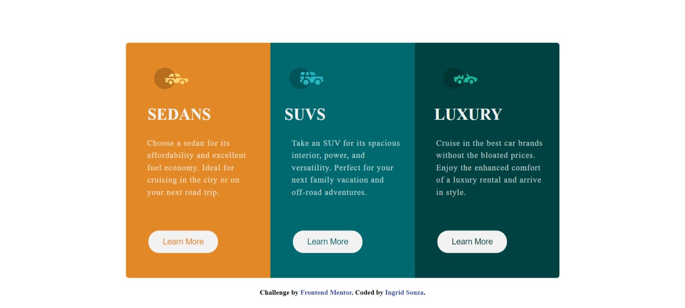

# Frontend Mentor - 3-column preview card component solution

This is a solution to the [3-column preview card component challenge on Frontend Mentor](https://www.frontendmentor.io/challenges/3column-preview-card-component-pH92eAR2-). Frontend Mentor challenges help you improve your coding skills by building realistic projects. 

## Table of contents

- [Screenshot](#screenshot)
- [Links](#links)
- [Built with](#built-with)
- [Author](#author)

### Screenshot

### Links

- Solution URL: [Solution here](https://ingridssilveira.github.io/3-column-preview-card-component-main/)
### Built with

- HTML
- CSS
- Flexbox
- Mobile-first workflow

## Author

- Website - [Ingrid Souza](https://ingridssilveira.github.io/IngridSouza)
- Frontend Mentor - [@IngridsSilveira](https://www.frontendmentor.io/profile/IngridsSilveira)
- GitHub - [@IngridsSilveira](https://github.com/IngridsSilveira)